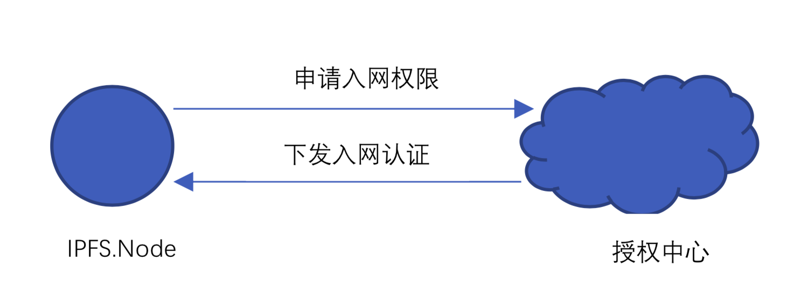
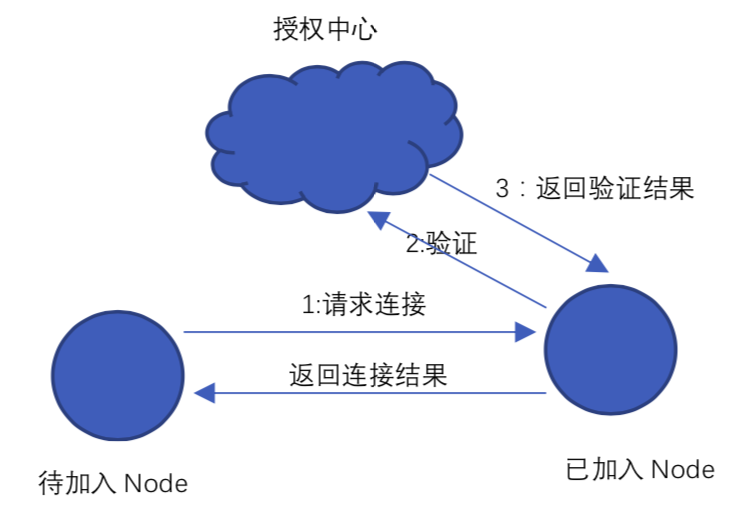
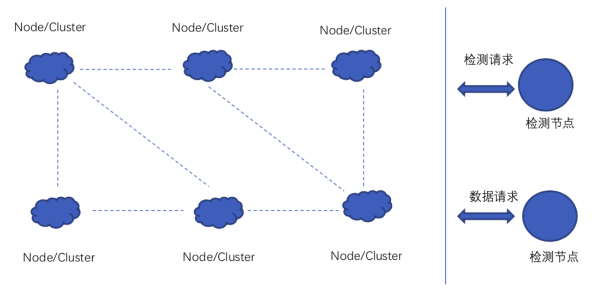
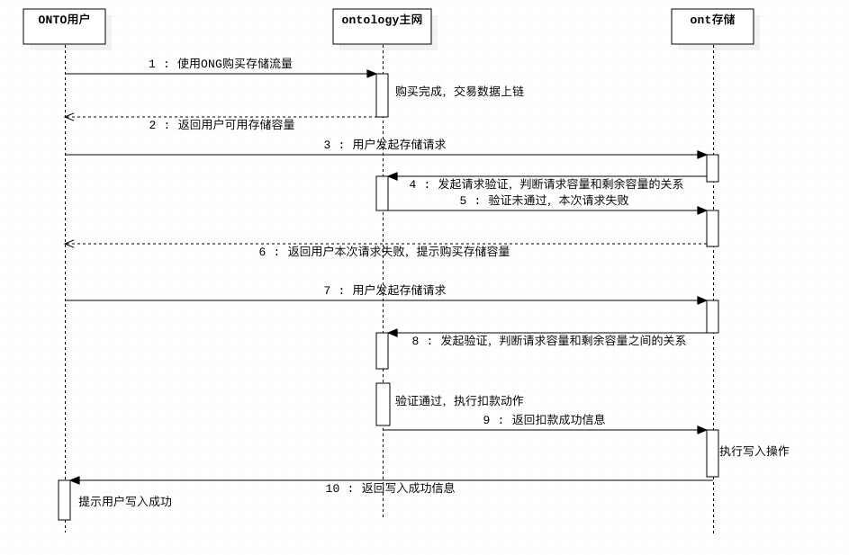

[TOC]

## 一. 综述

```
IPFS存储网络是一个完全分布式的P2P对等存储网络，IPFS不仅可以存储任意类型的数据、具备海量数据存储的能力，同时也具备CDN文件分发传输；目前，基于公网IPFS团队已经构建了一个IPFS存储网络；但考虑到以下几点：
	1. 由于IPFS网络中可能存储敏感数据的缘由，IPFS公网网关目前被墙；
	2. 公网是完全开放的，单一组织对其可控性极弱；
	3. IPFS的设计初衷是为了网络文件传输，故而针对数据的安全性及服务的健壮性兼顾较弱；
	4. IPFS是一种通用性的网络文件传输协议，在和具体业务结合的过程中，可能会遇到服务”本地化“不兼容的情况；

基于以上4点，我们考虑基于IPFS构建适合Ontology的分布式存储网络，下面将从三个大方向上阐述本体分布式存储网络的构思，分别是：
	1. 私有存储网络的构建
	2. 私有存储网络的使用
	3. 私有存储网络对本体生态的初步支持
```


## 二. 私有IPFS存储网络的构建

### 存在的问题

1. #### IPFS网络可以随意加入退出

   ```
   a. 这种随意性破坏了服务的稳定性；
   b. 私有IPFS网络，对加入节点应该有限制门槛；目前IPFS无法支持这种应用场景；
   ```

2. #### IPFS网络的数据被打散存储后，没有考虑纠删机制

   ```
   由于IPFS只提供了数据存储检索机制，没有提供数据片冗余备份机制；当某一个服务节点宕机或者人为删除部分数据后，会削弱检索服务的鲁棒性；
   ```

3. #### IPFS网络数据明文存储

   ```
   IPFS网络数据是明文存储，任何人只要拿到文件Hash，就可以通过该Hash完整读取文件内容；破坏了数据隐私性；
   ```

4. #### IPNS

   ```
   a. IPNS在0.4.14的版本里，效率低下；目前已经到0.4.16版本，但是没有具体测试过目前版本的性能；
   b. 对于协议头，目前使用的时候ipfs://的模式；如果基于IPFS构建私有存储网络，应该定制ont本地化的协议名；例如： ont://ont.io/hash-value/file.name
   
   说明：IPNS 代表的是IPNS中的命名空间，不是代表IPFS中的域名系统；
   ```

   

### 改进方案

1. #### 如何克服随意加入退出的问题

   ```
   1. 引入存储节点质押机制，对于加入该存储网络的节点需要提前质押相应token；以此防止恶意退出；
   2. 引入中央授权服务器，需要加入存储网络的节点，应提前获得中央节点的认证授权；
      各个节点在网络连通前，需要互相确认身份；
   3. 引入节点数据定时备份机制，防止节点到期下线后数据丢失的问题；
   ```

   

2. #### 如何克服节点随意删除数据的问题

   ```
   1. 引入数据持有性证明机制；
   2. 引入检查节点，定期检查节点数据是否满足完备性；
   3. 引入存储质押机制；
   ```

   

3. #### 如何克服数据明文存储问题

   ```
   在应用层对即将写入私有IPFS网络的数据进行本地化加密；通过提供go-ipfs-api开发包，让用户自由选择加密机制，然后通过Put接口上传至IPFS私有网络；
   ```

   

4. #### 构建独有协议名称

   ```
   修改IPFS内核源码，集中在IPLD模块，将/ipfs改写成本体自定义协议名；
   ```

   

### 构建流程

1. #### 获得权限流程

   

2. #### 加入流程

   

3. #### 完整网络模型

   


## 三. 私有IPFS存储网络的使用

### 准备工作

```
1. 改造go-ipfs-api SDK包，使得该SDK包支持上层用户选择加密算法，对存储数据进行加密；
2. 将本体的区块数据及交易数据，按照IPFS统一的数据格式，进行插件化适配；适配主要是为了方便IPFS基于其对命名空间管理，进而达到对本体数据的快速读取；
	如果不适配，则按照默认的RAW格式的数据进行写入，在二级索引的时候，只能抛给用户层处理；
```

### 数据存储

```
1. 调用ontology存储质押接口，进行ONG质押；
2. 基于go-ipfs-api开发包，通过其接口进行数据写入；
3. IPFS网络在收到写入请求后，首先验证ONG可用量是否合法；
4. 将数据按照IPFS机制，打散成N个block，分散写入相应的存储节点，并更新其DHT数据表；
```

### 数据获取

```
关于数据读取，有两种模式：
1. 通过go-ipfs-api开发包，直接进行数据读取，不会涉及到用户付费；
2. 考虑用户付费模型，按照读取流量大小进行收费；
```

### 私有IPFS网络管理

```
1. 授权管理
2. 授权验证
3. 质押ONG管理
4. 数据完整性检测
5. 备份管理
```

### 经济模型

1. #### 存储节点质押

   ```
   a. ontology内置质押native合约；加入IPFS私有存储网络的节点，通过该合约质押ONG；
   b. 定期触发native存储合约，如果恶意退出，执行扣款；
   c. 定期触发native存储合约，如果节点运行良好，当存储到期后，执行结算功能；
   ```

2. #### 用户付费

   ```
   a. ontology内置用户存储合约；
   b. 当用户发起存储请求时，付费模型有如下几种可能：
     b.1 一次性固定收费；例如：存储一次收取N个ONG；
     b.2 按照用户的存储容量进行收费；
     b.3 按照用户的存储时长和存储容量，进行收费；
     b.4 进一步考虑，当用户数据有丢失的时候，进行赔付；
   ```


## 四. 私有IPFS网络对本体生态的初步支持

1. ### 支持的存储数据类型

   ```
   字符串、数字、json对象、音频、视频、大文本等；
   ```

2. ### ONTO应用下的存储流程介绍

   ```
   a. 用户在前端界面，以ONG的形式购买本体网络的存储服务；
   b. 用户通过ONTO，上传个人数据，例如图片、影像、音频等；
   c. 计算用户此次存储，需要消耗的ONG数量；
   d. 用户上传数据时，如果用于存储服务的ONG余量合法，则放行服务；否则拒绝，并给予前端提示语；
   ```

