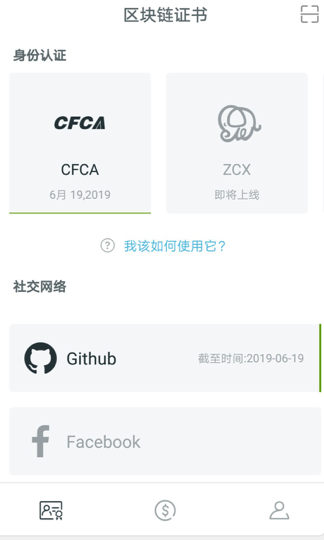

[TOC]

## 本体存储场景分析

### 区块链系统的存储弊端

```
区块链自2009年起，发展至今已有近10年时间；10年间，出现了以比特币、以太坊为代表的第一代及第二代区块链系统；下面我们将以比特币和以太坊为例，分析区块链上的数据特点；
1. 两个系统自上线之日起，均积累了大量的数据；截止目前，以太坊已经超过了300GB，比特币已经超过了180GB；基于区块链系统的去中心化、防篡改的特性，每一个加入比特币或者以太坊的全节点，都将保有全网数据；随着时间的增长，区块链上的存储数据也会呈线性增长，这无疑会给部分节点带来很大存储压力；

2. 每一个新加入的系统节点，都需要做全网的数据同步，以保证数据的公正性和不可篡改性；但是，当系统运行很长时间积累海量区块数据后，区块同步将会给节点的冷启动，带来巨大时间压力；同时，使得系统的网络开销陡增；

3. 基于2/8原则，最近20%的区块数据的使用频次是最高的；而较旧的数据，随着时间的推移，系统对其使用的依赖性会越来越低，这极大的降低了存储硬盘的有效利用率；

4. 系统运营及统计分析，是区块链里非常重要的一环；在这种场景下，对数据的获取将远大于数据的持有；因此，对于运营分析，非常迫切需要有一个公开的统一的数据源；

5. 从区块链存储的数据类型来看，目前只能存储简单的交易类型数据；一旦遇到流媒体文件、大文本文件时，区块链在数据存储上就变得非常被动；

以上是经典区块链系统的数据特点；同样的，这些数据存储及使用问题，在可预见的未来，ONT同样也会面对；因此，设计并实现一个分布式的、去中心化的、数据共享的存储系统，很有必要；
```


### 应用生态里的存储场景

`ONTO数据场景`

```
ONTO是基于本体的综合客户端产品，是本体信任搜索引擎和区块链体系的入口。ONTO将帮助用户实现包括数字身份管理、数字资产管理、分布式数据交换等综合性功能。
在产品实施的过程中，会围绕如下几种场景产生用户数据：

1. 用户通过ONTO创建数字身份，为了尊重保护用户的数据隐私，数字身份信息将交由终端用户保存备份；

2. 用户通过ONTO创建数字钱包，该数字钱包私钥文件及相关的助记录词都需要用户在终端自主备份；

3. 通过ONTO产生的身份认证数据，例如：CFCA、ZCX等认证数据，目前都是交由终端用户自主保存；

4. 通过ONTO产生的社交证明信息，例如github、twitter、facebook等社交认证，目前是交由终端用户自主保存；

以上几类用户数据，通过数据归属权的下放，保证了数据安全性；由于每一类用户隐私数据都将管理权限释放给用户，也给用户管理自身数据带来了很大的麻烦；例如数据的备份、转移、同步；
因此，从产品的易用性和人性化的角度，为ONTO用户提供一个去中心的可辨识的分布式存储系统，是一个很有必要的举措；
```



`本体生态内的数据场景`

```
本体是新一代公有基础链项目，致力于构建一个分布式信任协作平台；基于这样的愿景，在可预见的未来，本体生态内可能会存在的数据场景包括如下几部分：
1. 多方安全计算场景；
	针对多方安全计算的场景，为了保证待计算数据的安全性及中立性，本体需要有一个去中心化的存储系统；
2. KYC场景；
	对于KYC数据，KYC数据的参与方，同样也会有数据中立性和安全性的诉求；
3. smartx场景；
	smartx是本体团队为智能合约开发者提供的可视化WEB开发工具，目前通过smartx工具产生的智能合约代码，全部是存储于中心化服务器的；这种架构部署违背了区块链产品去中心化的特性；一旦中心化存储服务器出现故障，将会导致智能合约文件获取失败；
4. 其他数据协作场景
```

`分布式存储系统可以服务的其他场景`

```
1. 高速、地铁、大厦安保等视频监控，会产生大量的视频数据，这些数据的数据非常大但是读写频次非常低，只有在出现事故需要验证的时候才会使用，如果采用传统存储，极大的削弱了硬盘的有效利用率；
2. 大数据公司，为了产生合理的分析结论，往往需要海量的数据做支撑；
3. 保险公司为了保证服务质量，在服务过程中，往往会有电话录音；
4. 医院每天产生大量的影像数据；
......

以上这些数据，都有这么几个特点：a)数据海量； b)读写频次及低); c)数据的保留只是为了应对突发状况，以便验证之用； d)对存储的性价比非常敏感；
相较于中心化的云存储方案，分布式存储可以在存储价格、存储量上有极大的优势；
```


## 本体存储系统需求

### 业务需求描述

#### 可辨识性

```
用户通过界面，可以明确知道所使用的存储系统是去中心化分布式存储系统；
```

#### 存储能力

```
由于前期用户量很低，对系统性能暂无要求；
```


### 系统基础性能描述

#### 存储网络可控性描述

```
1. 本体存储网络，是一个分布式存储系统；针对这样一个分布式系统，对于加入的节点是有限制的；不会像公链一般可以随意加入退出；
2. 对于即将加入和退出的存储节点，都有相应的流程限制；
```

#### 数据安全性描述

```
1. 参与存储的服务节点，会在一定时间内提供可靠的服务；当服务到期，需要对数据做快照备份，并通知网络；
2. 对于存储的数据内容，系统应提供完善的数据加密功能，不建议明文存储；
```

#### 数据可靠性描述

```
1. 写入本体存储系统的数据，不可以被存储节点删除，通过引入检查节点的方式，定时的对存储节点做持有性证明；
2. 当用户误删部分存储数据时，系统应提供一种证明机制，保证数据的可恢复性；
```

#### 系统易用性描述

```
1. 从写入角度描述
	用户写入时，后面的存储实现对用户完全透明，只需要通过简单的、统一的写接口完成；
2. 从读取角度描述
	用户读取的时候，后端的存储实现同样是透明；
	针对同一个文件，在用户做了修改行为后再次读取，用户的读操作不需要做同步调整；(例如IPFS里面提供 IPNS机制)
```


## 建议解决方案

### 综述

```
在中心化的存储方案中，我们可以明显的发现：
1).这种方案极大的破坏了数据的隐私性和安全性；
2).针对读取需求不高的数据，中心化的存储方案，极大降低了存储介质的有效利用率，带来了存储资源的浪费；
3).与此同时，中心化存储方案，伴有严重的数据操控嫌疑；
相较于此，分布式存储方案，可以完全避免上述的存储弊端；此外，当分布式存储网络，达到一定的系统规模，将会极大的提高网络分发的效率；同时提高系统的健壮性；
```


### 技术路线调研

```
此次调研，我们主要分析了IPFS、StorJ、Genaro、Siacoin、MaidSafe、Burstcoin6款分布式存储方案，并从产品特性、产品技术栈、产品趋势分布及产品社区活跃度四个方向做了比对，如下所示：
```

#### 产品特性

|   项目    |                   Features                    |
| :-------: | :-------------------------------------------: |
|   ipfs    | 内容可寻址、版本化、点对点超媒体的分布式协议  |
|   storj   | 去中心化、端到端加密、可持续的云存储，B端市场 |
|  Genaro   |        图灵计算完备的去中心化存储网络         |
|  siacoin  |               去中心化存储平台                |
| MaidSafe  |         自治理、去中心分布式存储网络          |
| Burstcoin |          基于容量证明的去中心化存储           |

#### 产品技术栈

|   项目    |  language  |
| :-------: | :--------: |
|   ipfs    |     Go     |
|   storj   | Javascript |
|  Genaro   | Javascript |
|  siacoin  |     Go     |
| MaidSafe  |  Rust/C++  |
| Burstcoin |    Java    |

#### 产品趋势分布


#### 代码活跃度

|     项目      | issues | watch | star | fork | commits |
| :-----------: | :----: | :---: | :--: | :--: | :-----: |
| ipfs/filecoin |  817   |  427  | 5.5K | 965  |  8616   |
|     storj     |   51   |  99   | 461  | 114  |  1246   |
|    Genaro     |   0    |  18   |  26  |  6   |   276   |
|    siacoin    |  122   |  322  | 2.6K | 413  |  8912   |
|   MaidSafe    |   14   |  143  | 592  | 110  |  1791   |
|   Burstcoin   |   24   |  67   | 181  | 147  |  2125   |


#### 总结

```
针对以上的6种分布式存储产品的比对和本体对分布式存储的需求，我们决定基于IPFS+Ontology构建一个适用于本体生态的安全可信的、分布式存储系统；
```


###方案思路设计

1. 在网络节点安全方面

   ```
   1). 引入存储节点质押机制；
   对于加入该存储网络的节点需要提前质押相应token；以此防止恶意退出；
   
   2). 引入入网合约机制；
   需要加入存储网络的节点，应提前获得入网合约的统一授权；各个节点在网络连通前，需要互相确认身份；
   
   3). 引入节点数据定时备份机制；
   防止节点到期下线后数据丢失的问题；
   ```

2. 在数据安全及可靠性方面

   ```
   1). 引入数据持有性证明机制；
   2). 引入检查节点，定期检查节点数据是否满足完备性；
   3). 引入存储质押机制；
   ```

3. 在经济模型方面

    ```
   用户的存储需求，需要伴随一定的ONG支出；对于加入存储网络的节点，在参与存储的过程中，会有一定的ONG分成收益；
    ```

   3.1 存储节点质押

   ```
   a. ontology内置质押native合约；加入本体私有存储网络的节点，通过该合约质押ONG；
   b. 定期触发native存储合约，如果恶意退出，执行扣款；
   c. 定期触发native存储合约，如果节点运行良好，当存储到期后，执行结算功能；
   ```

   3.2  用户付费

   ```
   a. ontology内置用户存储合约；
   b. 当用户发起存储请求时，付费模型有如下几种可能：
     b.1 一次性固定收费；例如：存储一次收取N个ONG；
     b.2 按照用户的存储容量进行收费；
     b.3 按照用户的存储时长和存储容量，进行收费；
     b.4 进一步考虑，当用户数据有丢失的时候，进行赔付；
   ```

4. 存储网络构建过程说明

   ```
   a). ontology内置入网合约；该入网合约，仅部署在本体7个出块节点上；
   b). 每一个待加入节点，需要向主网发起入网申请；入网合约会判断，是否符合入网条件，如果符合则共识落块，并颁发入网通证；
   c). 获得入网通证后，进行存储质押；
   d). 节点获得入网通证后，凭此通证和其他存储节点进行互联；在联通过程中，进行身份有效性的确认；
   e). 连接建立后，开始进行数据的存储及传输；
   ```

   完整网络模型

   


